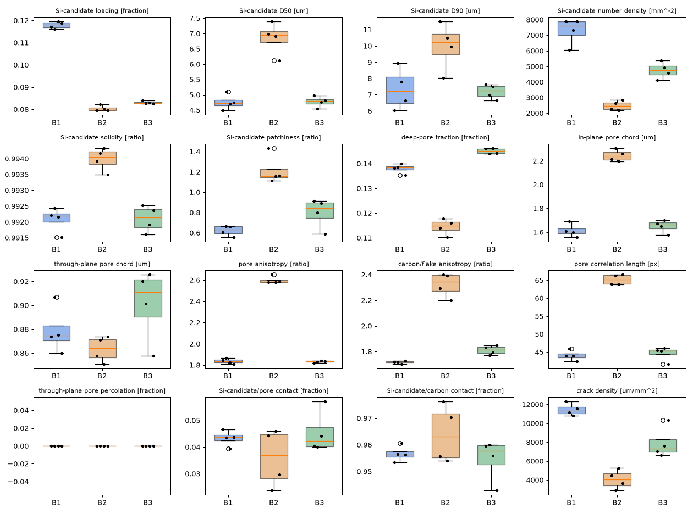

# VALIDATION

_Generated by `qc validate` — baseline version 97625928; labelled images: batch 3: 1._

> **Small or incomplete labelled set.** With these counts the LOIO numbers below are not a measure of accuracy on an unseen batch; they demonstrate the machinery. Add the remaining Drive images (`qc fetch`) and rerun.

## 1. Leave-one-image-out (nested: Δ and T tuned inside each fold; baseline stats rebuilt without the held-out image)

Not enough labelled images for LOIO.

## 2. Which KPIs separate the batches (effect = |Δ median| / pooled robust scale)

Needs at least two labelled batches.

## 3. Batch signatures

## 4. Confound check — shadow classifier on acquisition gates only

Gates used: inlens_c_med, etd_c_med, comb_step_bse, n_grey_levels_bse, noise_sd_bse, height_px, blur_bse. LOIO accuracy: **nan** (n=0).

## 5. Threshold and resolution sensitivity (Δ in units of baseline scale)

|                                   |   50nm/px (2x down) |   t1+5 |   t1-5 |   t2+5 |   t2-5 |
|:----------------------------------|--------------------:|-------:|-------:|-------:|-------:|
| ('aniso_carbon_chord_ratio', 'R') |                1.06 |   0.03 |   0.08 |   0.04 |   0.12 |
| ('aniso_pore_chord_ratio', 'R')   |                1.09 |   0.06 |   0.02 |   0.00 |   0.02 |
| ('crack_density_um_per_mm2', 'M') |                2.46 |   0.00 |   0.00 |   0.00 |   0.00 |
| ('pore_chord_h_mean_um', 'R')     |                4.67 |   0.23 |   0.46 |   0.01 |   0.03 |
| ('pore_chord_v_mean_um', 'R')     |                2.95 |   0.15 |   0.36 |   0.01 |   0.01 |
| ('pore_frac_deep', 'W')           |                0.14 |   2.19 |   2.03 |   0.03 |   0.05 |
| ('pore_frac_se_imagerep', 'R')    |                0.04 |   0.19 |   0.19 |   0.00 |   0.00 |
| ('pore_percolating_frac_v', 'M')  |                0.00 |   0.00 |   0.00 |   0.00 |   0.00 |
| ('s2_len_pore_h_px', 'R')         |                0.63 |   0.00 |   0.15 |   0.01 |   0.01 |
| ('s2_len_pore_v_px', 'R')         |                0.42 |   0.13 |   0.14 |   0.01 |   0.01 |
| ('s2_len_si_px', 'R')             |                0.36 |   0.00 |   0.00 |   0.15 |   0.49 |
| ('si_aspect_med', 'R')            |                1.15 |   0.00 |   0.00 |   0.51 |   0.29 |
| ('si_circularity_med', 'R')       |                2.24 |   0.00 |   0.00 |   0.97 |   2.46 |
| ('si_contact_carbon_frac', 'R')   |                0.63 |   0.22 |   0.13 |   0.09 |   0.18 |
| ('si_contact_pore_frac', 'R')     |                6.22 |   2.20 |   1.25 |   0.94 |   1.79 |
| ('si_d50_aw_um', 'R')             |                0.76 |   0.00 |   0.00 |   1.26 |   0.82 |
| ('si_d90_aw_um', 'R')             |                0.06 |   0.00 |   0.00 |   0.16 |   0.03 |
| ('si_frac_se_imagerep', 'R')      |                0.00 |   0.00 |   0.00 |   0.04 |   0.09 |
| ('si_frac_solid', 'M')            |                0.20 |   0.16 |   0.15 |   0.35 |   0.82 |
| ('si_num_density_mm2', 'M')       |                4.23 |   0.00 |   0.00 |   1.39 |   6.81 |
| ('si_quadrat_cv', 'M')            |                0.04 |   0.00 |   0.00 |   0.14 |   0.37 |
| ('si_solidity_med', 'R')          |                0.33 |   0.00 |   0.00 |   0.15 |   0.79 |
| ('st_coherence', 'R')             |                4.09 |   0.29 |   0.41 |   0.15 |   0.13 |

R-class KPIs moving > 0.5 scale under ±5-level threshold shifts: si_contact_pore_frac, si_d50_aw_um, si_solidity_med, si_circularity_med, si_aspect_med (target: none).

## 6. Synthetic ground truth

|   rep | kpi                    |   truth |   measured |   error |    tol | kind   | ok   |
|------:|:-----------------------|--------:|-----------:|--------:|-------:|:-------|:-----|
|     0 | si_frac_total          |  0.0766 |     0.0766 |  0.0001 | 0.0050 | abs    | True |
|     0 | pore_frac_deep         |  0.1357 |     0.1411 |  0.0054 | 0.0100 | abs    | True |
|     0 | si_d50_aw_um           |  6.5080 |     6.5098 |  0.0003 | 0.1000 | rel    | True |
|     0 | aniso_pore_chord_ratio |  1.9724 |     1.8489 |  0.0626 | 0.1000 | rel    | True |
|     1 | si_frac_total          |  0.0760 |     0.0761 |  0.0000 | 0.0050 | abs    | True |
|     1 | pore_frac_deep         |  0.1381 |     0.1431 |  0.0050 | 0.0100 | abs    | True |
|     1 | si_d50_aw_um           |  4.3927 |     4.3927 |  0.0000 | 0.1000 | rel    | True |
|     1 | aniso_pore_chord_ratio |  1.9213 |     1.7959 |  0.0653 | 0.1000 | rel    | True |
|     2 | si_frac_total          |  0.0764 |     0.0764 |  0.0000 | 0.0050 | abs    | True |
|     2 | pore_frac_deep         |  0.1416 |     0.1471 |  0.0055 | 0.0100 | abs    | True |
|     2 | si_d50_aw_um           |  4.5547 |     4.5558 |  0.0002 | 0.1000 | rel    | True |
|     2 | aniso_pore_chord_ratio |  1.9531 |     1.8350 |  0.0604 | 0.1000 | rel    | True |
|     3 | si_frac_total          |  0.0848 |     0.0849 |  0.0001 | 0.0050 | abs    | True |
|     3 | pore_frac_deep         |  0.1352 |     0.1402 |  0.0050 | 0.0100 | abs    | True |
|     3 | si_d50_aw_um           |  4.4247 |     4.4266 |  0.0004 | 0.1000 | rel    | True |
|     3 | aniso_pore_chord_ratio |  1.9532 |     1.8386 |  0.0587 | 0.1000 | rel    | True |

- Clark–Evans R: Poisson placement 1.05 (target 1 ± 0.1), clustered 0.42 (target < 0.8) → PASS
- ImageRep SE of Si fraction: mean 0.0206 vs empirical SD over replicates 0.0232 (ratio 0.89; target within ×2) → PASS

Perturbation robustness (R-class KPIs, Δ in replicate-baseline scale units; target < 0.25, verdict unchanged):

| variant        | worst_R_kpi          |   worst_delta_scale | ok    | R_kpis_over_0_25                                                                                                 | verdict_ref   | verdict_perturbed   | verdict_same   |
|:---------------|:---------------------|--------------------:|:------|:-----------------------------------------------------------------------------------------------------------------|:--------------|:--------------------|:---------------|
| brightness+15% | si_contact_pore_frac |               0.352 | False | si_contact_pore_frac 0.35                                                                                        | REJECT        | REJECT              | True           |
| contrast x0.85 | si_contact_pore_frac |               0.360 | False | si_contact_pore_frac 0.36                                                                                        | REJECT        | REJECT              | True           |
| gamma 1.2      | si_contact_pore_frac |               0.524 | False | pore_chord_h_mean_um 0.51; aniso_pore_chord_ratio 0.37; aniso_carbon_chord_ratio 0.28; si_contact_pore_frac 0.52 | REJECT        | REJECT              | True           |
| noise SD 5     | si_contact_pore_frac |               0.100 | True  | none                                                                                                             | REJECT        | REJECT              | True           |

---

# Appendix — pipeline demonstration on a SYNTHETIC 3-batch dataset (not real data)

Only one real image was available in the build container, so the multi-batch machinery (nested LOIO, signatures, shadow classifier) was exercised on 12 full-size synthetic samples (`python -m qc synth --per-batch 4 --width 7000 --height 2000`): batch 3 = baseline, batch 1 = Si loading 7 % → 10 %, batch 2 = coarser Si (D50 4 → 5.5 µm), flatter pores (aspect 2 → 3) and lower porosity. These numbers show the machinery works; they say nothing about accuracy on the real batches. The shadow-classifier warning is expected here: in synthetic images the gate medians are tied to the simulated material.

### 1. Leave-one-image-out (nested: Δ and T tuned inside each fold; baseline stats rebuilt without the held-out image)

- Accuracy: **0.83** (10/12)
- Mean negative log-likelihood: 0.260 (uniform guess = 1.099); Brier score: 0.182
- **False alarms** (batch-3 images given INVESTIGATE/REJECT when held out): 1 / 4
- **Detections** (batch-1/2 images given INVESTIGATE/REJECT): 8 / 8
- Strip consistency (share of strips agreeing with the parent image call): 0.83 (target > 0.7)
- p-value floor: with n = 4 baseline images the smallest achievable rank p-value is 0.200; no significance is claimed beyond that.

Confusion matrix (rows = true, columns = predicted):

|   true |   1 |   2 |   3 |
|-------:|----:|----:|----:|
|      1 |   3 |   0 |   1 |
|      2 |   0 |   4 |   0 |
|      3 |   1 |   0 |   3 |

Per-image results:

| sample_id   |   true |   pred |    p1 |    p2 |    p3 |   stability |   strip_agreement |   strip_vs_truth | verdict     |     S | novelty   |   delta |     T | top3                                                           |   classes_trained |
|:------------|-------:|-------:|------:|------:|------:|------------:|------------------:|-----------------:|:------------|------:|:----------|--------:|------:|:---------------------------------------------------------------|------------------:|
| img_syn1x00 |      1 |      1 | 1.000 | 0.000 | 0.000 |       1.000 |             1.000 |            1.000 | REJECT      | 3.204 | False     |   0.000 | 1.000 | si_num_density_mm2, crack_density_um_per_mm2, si_frac_solid    |               123 |
| img_syn1x01 |      1 |      3 | 0.485 | 0.000 | 0.515 |       0.549 |             0.600 |            0.400 | INVESTIGATE | 2.383 | False     |   0.000 | 2.000 | crack_density_um_per_mm2, si_frac_solid, si_d90_aw_um          |               123 |
| img_syn1x02 |      1 |      1 | 0.998 | 0.000 | 0.002 |       1.000 |             1.000 |            1.000 | INVESTIGATE | 2.700 | False     |   0.500 | 1.000 | si_num_density_mm2, si_frac_solid, crack_density_um_per_mm2    |               123 |
| img_syn1x03 |      1 |      1 | 1.000 | 0.000 | 0.000 |       0.995 |             0.800 |            0.800 | REJECT      | 3.083 | False     |   0.500 | 1.000 | si_num_density_mm2, crack_density_um_per_mm2, si_frac_solid    |               123 |
| img_syn2x00 |      2 |      2 | 0.000 | 1.000 | 0.000 |       1.000 |             1.000 |            1.000 | REJECT      | 7.814 | False     |   0.500 | 1.000 | s2_len_pore_h_px, aniso_pore_chord_ratio, si_d50_aw_um         |               123 |
| img_syn2x01 |      2 |      2 | 0.000 | 1.000 | 0.000 |       1.000 |             1.000 |            1.000 | REJECT      | 8.863 | False     |   0.500 | 1.000 | s2_len_pore_h_px, aniso_pore_chord_ratio, si_d50_aw_um         |               123 |
| img_syn2x02 |      2 |      2 | 0.000 | 1.000 | 0.000 |       1.000 |             1.000 |            1.000 | REJECT      | 7.717 | False     |   0.500 | 1.000 | aniso_pore_chord_ratio, s2_len_pore_h_px, si_d50_aw_um         |               123 |
| img_syn2x03 |      2 |      2 | 0.000 | 1.000 | 0.000 |       1.000 |             1.000 |            1.000 | REJECT      | 8.234 | False     |   0.500 | 1.000 | s2_len_pore_h_px, aniso_pore_chord_ratio, pore_chord_h_mean_um |               123 |
| img_syn3x00 |      3 |      3 | 0.000 | 0.000 | 1.000 |       0.988 |             0.800 |            0.800 | ACCEPT      | 0.972 | False     |   0.500 | 0.500 | si_num_density_mm2, si_d90_aw_um, si_quadrat_cv                |               123 |
| img_syn3x01 |      3 |      3 | 0.001 | 0.000 | 0.999 |       0.778 |             0.600 |            0.600 | ACCEPT      | 0.982 | False     |   0.500 | 0.500 | si_num_density_mm2, si_d50_aw_um, si_quadrat_cv                |               123 |
| img_syn3x02 |      3 |      3 | 0.004 | 0.000 | 0.996 |       0.851 |             0.600 |            0.600 | ACCEPT      | 0.623 | False     |   0.500 | 0.500 | si_d90_aw_um, pore_chord_h_mean_um, si_quadrat_cv              |               123 |
| img_syn3x03 |      3 |      1 | 0.908 | 0.000 | 0.092 |       0.755 |             0.600 |            0.400 | INVESTIGATE | 2.495 | False     |   0.500 | 0.500 | si_contact_pore_frac, si_quadrat_cv, crack_density_um_per_mm2  |               123 |

### 2. Which KPIs separate the batches (effect = |Δ median| / pooled robust scale)

**1 vs 2**

| kpi                      | class_   |   median_a |   median_b |   effect |
|:-------------------------|:---------|-----------:|-----------:|---------:|
| s2_len_pore_h_px         | R        |     43.965 |     65.139 |    7.621 |
| si_num_density_mm2       | M        |   7600.000 |   2457.143 |    7.424 |
| aniso_pore_chord_ratio   | R        |      1.835 |      2.584 |    6.685 |
| pore_chord_h_mean_um     | R        |      1.605 |      2.237 |    6.499 |
| aniso_carbon_chord_ratio | R        |      1.719 |      2.344 |    6.077 |
| crack_density_um_per_mm2 | M        |  11348.571 |   4037.143 |    5.029 |
| si_d50_aw_um             | R        |      4.716 |      6.948 |    3.761 |
| pore_frac_deep           | W        |      0.138 |      0.115 |    3.659 |

**1 vs 3**

| kpi                      | class_   |   median_a |   median_b |   effect |
|:-------------------------|:---------|-----------:|-----------:|---------:|
| si_num_density_mm2       | M        |   7600.000 |   4742.857 |    3.553 |
| crack_density_um_per_mm2 | M        |  11348.571 |   7331.429 |    2.503 |
| si_frac_solid            | M        |      0.118 |      0.083 |    2.401 |
| si_quadrat_cv            | M        |      0.633 |      0.846 |    2.265 |
| aniso_carbon_chord_ratio | R        |      1.719 |      1.813 |    1.054 |
| pore_frac_deep           | W        |      0.138 |      0.145 |    0.951 |
| pore_chord_v_mean_um     | R        |      0.875 |      0.911 |    0.814 |
| pore_chord_h_mean_um     | R        |      1.605 |      1.662 |    0.709 |

**2 vs 3**

| kpi                      | class_   |   median_a |   median_b |   effect |
|:-------------------------|:---------|-----------:|-----------:|---------:|
| s2_len_pore_h_px         | R        |     65.139 |     45.395 |    7.033 |
| aniso_pore_chord_ratio   | R        |      2.584 |      1.834 |    6.694 |
| pore_chord_h_mean_um     | R        |      2.237 |      1.662 |    5.832 |
| aniso_carbon_chord_ratio | R        |      2.344 |      1.813 |    5.074 |
| pore_frac_deep           | W        |      0.115 |      0.145 |    4.583 |
| si_d50_aw_um             | R        |      6.948 |      4.785 |    3.592 |
| si_num_density_mm2       | M        |   2457.143 |   4742.857 |    3.255 |
| si_d90_aw_um             | R        |     10.225 |      7.239 |    3.056 |

### 3. Batch signatures

- Batch 1 (n=4): si_num_density_mm2 +3.5σ, crack_density_um_per_mm2 +2.6σ, si_frac_solid +2.6σ, si_quadrat_cv −1.9σ
- Batch 2 (n=4): s2_len_pore_h_px +8.7σ, aniso_pore_chord_ratio +8.2σ, si_d50_aw_um +7.0σ, pore_chord_h_mean_um +6.9σ, aniso_carbon_chord_ratio +5.9σ, pore_frac_deep −4.1σ, si_d90_aw_um +3.9σ, si_num_density_mm2 −2.8σ, si_quadrat_cv +2.8σ, crack_density_um_per_mm2 −2.1σ
- Overlap of batch-1 and batch-2 signatures: 0.00 (1 = identical; high overlap → 1-vs-2 calls are low-confidence by construction)

### 4. Confound check — shadow classifier on acquisition gates only

Gates used: inlens_c_med, etd_c_med, comb_step_bse, n_grey_levels_bse, noise_sd_bse, height_px, blur_bse. LOIO accuracy: **0.75** (n=12).

> **WARNING: acquisition gates alone separate the batches about as well as the material KPIs.** The batches may differ by imaging session as much as by material; read material conclusions with that in mind.

### 5. Threshold and resolution sensitivity (Δ in units of baseline scale)

Not run (use `qc validate` without `--skip-sensitivity`).

### 6. Synthetic ground truth

Not run (use `qc validate` without `--skip-synthetic`).
