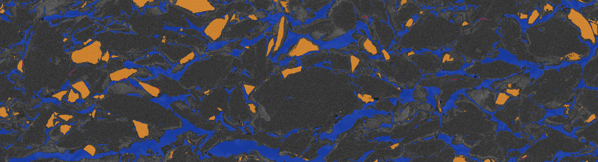
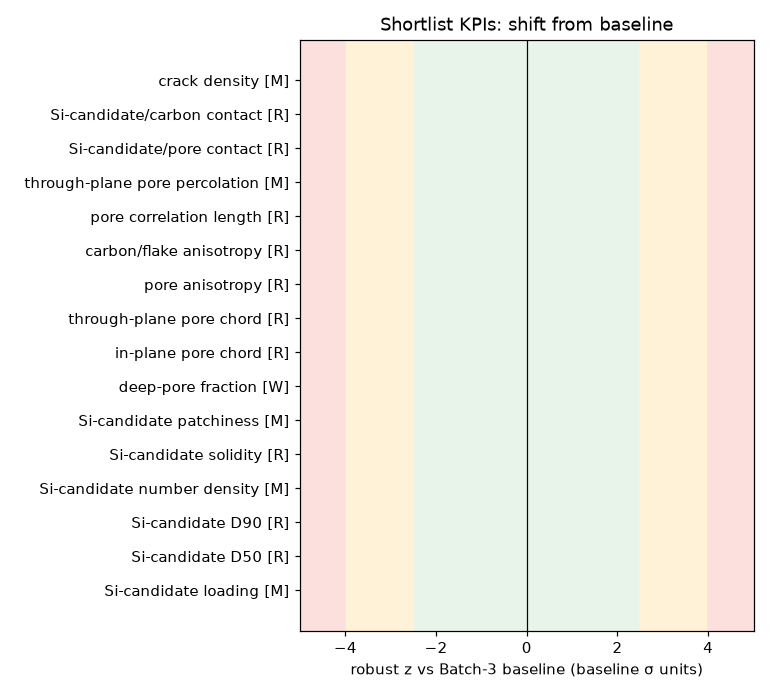
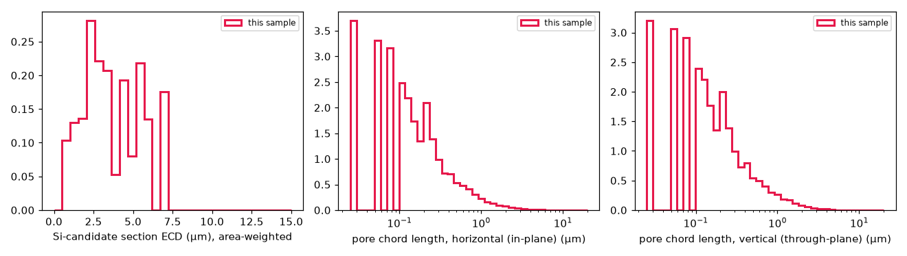
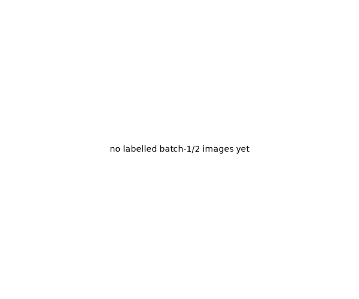

# QC report — img_0grcilhi

## 1. Verdict

**img_0grcilhi is most consistent with Batch 3** (probability 1.00; no other batch trained; assignment stable in 100 % of strip-bootstrap resamples; confident). (No labelled images available for batch(es) 1, 2; they cannot be assigned.) **Relative to the Batch-3 baseline it is within the baseline distribution — verdict ACCEPT**: 0 of 16 KPIs exceed 2.5 robust σ. Largest shifts: Si-candidate loading 6.29 % vs 6.29 % ± 1.02 % (z = +0.0); Si-candidate D50 3.35 µm vs 3.35 µm ± 0.349 (z = +0.0); Si-candidate D90 6.09 µm vs 6.09 µm ± 0.537 (z = +0.0). Baseline has 1 image(s), so the smallest reportable rank p-value is 0.500; this verdict is an effect-size judgement, not a significance test.

## 2. Acquisition gates

Status: **ok** — flags: shading_flag

| gate | value | z |
|---|---|---|
| `n_grey_levels_bse` | 177.0 | +0.0 |
| `comb_step_bse` | 1.00 | +0.0 |
| `noise_sd_bse` | 10.0 | +0.0 |
| `blur_bse` | 0.221 | +0.0 |
| `sat0_bse` | 0.016 | +0.0 |
| `sat255_bse` | 0.000 | +0.0 |
| `sat0_etd` | 0.025 | +0.0 |
| `sat255_etd` | 0.000 | +0.0 |
| `sat0_inlens` | 0.011 | +0.0 |
| `sat255_inlens` | 0.039 | +0.0 |

## 3. KPIs

| KPI | value ± SE | baseline median ± scale | z | class | shortlist |
|---|---|---|---|---|---|
| `si_frac_solid` | 6.29 % ± 1.02 % | 6.29 % ± 1.02 % | +0.00 | M | ✓ |
| `si_d50_aw_um` | 3.35 µm ± 0.349 | 3.35 ± 0.349 | +0.00 | R | ✓ |
| `si_d90_aw_um` | 6.09 µm ± 0.537 | 6.09 ± 0.537 | +0.00 | R | ✓ |
| `si_num_density_mm2` | 23,055 mm^-2 ± 1,817 | 23,055 ± 1,817 | +0.00 | M | ✓ |
| `si_solidity_med` | 0.882 ± 0.019 | 0.882 ± 0.044 | +0.00 | R | ✓ |
| `si_quadrat_cv` | 0.857 ± 0.113 | 0.857 ± 0.113 | +0.00 | M | ✓ |
| `pore_frac_deep` | 16.14 % ± 0.99 % | 16.14 % ± 0.99 % | +0.00 | W | ✓ |
| `pore_chord_h_mean_um` | 0.898 µm ± 0.063 | 0.898 ± 0.063 | +0.00 | R | ✓ |
| `pore_chord_v_mean_um` | 0.738 µm ± 0.065 | 0.738 ± 0.065 | +0.00 | R | ✓ |
| `aniso_pore_chord_ratio` | 1.22 ± 0.021 | 1.22 ± 0.061 | +0.00 | R | ✓ |
| `aniso_carbon_chord_ratio` | 1.20 ± 0.012 | 1.20 ± 0.060 | +0.00 | R | ✓ |
| `s2_len_pore_h_px` | 53.2 px ± 5.16 | 53.2 ± 5.16 | +0.00 | R | ✓ |
| `pore_percolating_frac_v` | 0.00 % ± 0.00 % | 0.00 % ± 0.50 % | +0.00 | M | ✓ |
| `si_contact_pore_frac` | 1.27 % ± 0.17 % | 1.27 % ± 0.50 % | +0.00 | R | ✓ |
| `si_contact_carbon_frac` | 98.73 % ± 0.17 % | 98.73 % ± 4.94 % | +0.00 | R | ✓ |
| `crack_density_um_per_mm2` | 2,486 µm/mm^2 ± 681.3 | 2,486 ± 681.3 | +0.00 | M | ✓ |
| `si_frac_total` | 5.28 % ± 0.86 % | 5.28 % ± 0.86 % | +0.00 | M |  |
| `si_d10_aw_um` | 1.35 µm ± 0.146 | 1.35 ± 0.146 | +0.00 | M |  |
| `si_span` | 1.41 ± 0.136 | 1.41 ± 0.136 | +0.00 | M |  |
| `si_aspect_med` | 1.76 ± 0.060 | 1.76 ± 0.088 | +0.00 | R |  |
| `si_circularity_med` | 0.599 ± 0.034 | 0.599 ± 0.034 | +0.00 | R |  |
| `si_interior_texture` | 0.783 ± 0.028 | 0.783 ± 0.039 | +0.00 | M |  |
| `si_clark_evans_R` | 0.833 ± 0.066 | 0.833 ± 0.066 | +0.00 | M |  |
| `si_agglomerate_frac` | 89.84 % ± 3.26 % | 89.84 % ± 4.49 % | +0.00 | M |  |
| `pore_frac_slope_per_level` | 0.004 1/level ± n/a | 0.004 ± 0.000 | +0.00 | W |  |
| `ambiguous_frac` | 0.97 % ± 0.05 % | 0.97 % ± 0.50 % | +0.00 | W |  |
| `pore_chord_h_p90_um` | 2.23 µm ± 0.235 | 2.23 ± 0.235 | +0.00 | M |  |
| `pore_lt_d50_um` | 1.09 µm ± 0.151 | 1.09 ± 0.151 | +0.00 | M |  |
| `st_coherence` | 0.133 ± 0.009 | 0.133 ± 0.009 | +0.00 | R |  |
| `st_orientation_deg` | 9.73 deg ± 4.52 | 9.73 ± 4.52 | +0.00 | R |  |
| `s2_len_pore_v_px` | 29.8 px ± 3.25 | 29.8 ± 3.25 | +0.00 | R |  |
| `s2_len_si_px` | 66.2 px ± 6.01 | 66.2 ± 6.01 | +0.00 | R |  |
| `s2_integral_range_pore_px2` | 15,828 px^2 ± 2,949 | 15,828 ± 2,949 | +0.00 | M |  |
| `pore_percolating_frac_h` | 0.00 % ± 10.24 % | 0.00 % ± 10.24 % | +0.00 | M |  |
| `pore_euler_density_mm2` | 78,530 mm^-2 ± 16,186 | 78,530 ± 16,186 | +0.00 | M |  |
| `interface_pore_solid_um_per_um2` | 0.624 µm^-1 ± 0.021 | 0.624 ± 0.031 | +0.00 | M |  |
| `largest_void_ecd_um` | 18.7 µm ± 1.35 | 18.7 ± 1.35 | +0.00 | M |  |
| `hiZ_inclusion_count_mm2` | 0.000 mm^-2 ± 0.000 | 0.000 ± 0.000 | +0.00 | M |  |
| `vertical_pore_slope` | 1.58 pp/10µm ± 1.01 | 1.58 ± 1.01 | +0.00 | W |  |
| `vertical_si_slope` | -1.69 pp/10µm ± 0.604 | -1.69 ± 0.604 | +0.00 | W |  |
| `si_frac_se_imagerep` | 1.07 % ± 0.31 % | 1.07 % ± 0.50 % | +0.00 | R |  |
| `pore_frac_se_imagerep` | 1.27 % ± 0.33 % | 1.27 % ± 0.50 % | +0.00 | R |  |

## 4. Drivers (shortlist, sorted by |z|)

- **Si-candidate loading** (`si_frac_solid`, class M): 6.29 % vs 6.29 % ± 1.02 %, z = +0.00 (lower) — less Si-candidate in the solid: lower capacity, less swelling
- **Si-candidate D50** (`si_d50_aw_um`, class R): 3.35 µm vs 3.35 µm ± 0.349, z = +0.00 (lower) — finer Si-candidate: more surface/SEI, less fracture
- **Si-candidate D90** (`si_d90_aw_um`, class R): 6.09 µm vs 6.09 µm ± 0.537, z = +0.00 (lower) — fewer coarse Si-candidate particles
- **Si-candidate number density** (`si_num_density_mm2`, class M): 23,055 mm^-2 vs 23,055 mm^-2 ± 1,817, z = +0.00 (lower) — fewer Si-candidate particles per area (coarser or less loaded)
- **Si-candidate solidity** (`si_solidity_med`, class R): 0.882 vs 0.882 ± 0.044, z = +0.00 (lower) — more irregular/porous Si-candidate shapes (grade change?)
- **Si-candidate patchiness** (`si_quadrat_cv`, class M): 0.857 vs 0.857 ± 0.113, z = +0.00 (lower) — Si-candidate more evenly distributed
- **deep-pore fraction** (`pore_frac_deep`, class W): 16.14 % vs 16.14 % ± 0.99 %, z = +0.00 (lower) — less deep porosity (lower bound): denser coating, slower ionic transport; consistent with heavier calendering
- **in-plane pore chord** (`pore_chord_h_mean_um`, class R): 0.898 µm vs 0.898 µm ± 0.063, z = +0.00 (lower) — narrower in-plane pores; consistent with heavier calendering

## 5. Batch assignment

| batch | probability | distance | signature match (σ) |
|---|---|---|---|
| 3 | 1.000 | 0.00 | — |

- Assigned: **Batch 3** — confident; strip-bootstrap stability 1.00; single-strip agreement 1.00
- Novelty flag: **no**; in-distribution score n/a
- Priors: uniform. T=2.0 and shrinkage Δ=0.0 chosen by leave-one-image-out log-loss on 1 labelled images; LOIO accuracy 0.00

## 6. Figures

**Segmentation overlay (blue = deep pore, orange = Si-candidate, red = crack skeleton; 4× downscaled)**

**Robust z-scores vs baseline (green < 2.5σ, amber 2.5–4σ, red > 4σ)**

**Si-candidate size and pore chord distributions vs pooled baseline**

**Batch signatures (what makes batches 1 and 2 different from baseline)**

## 7. Not measurable from these images

coating thickness, surface roughness, collector delamination, binder/carbon-black distribution, Si vs SiOx identity, true (total) porosity.

## Caveats

1. Bright particles are identified by backscatter Z-contrast only (no EDS); they are reported as Si-candidates and may include SiOx or Si-C composite.
2. Pores appear open (not resin-infiltrated); the deep-pore fraction is a lower bound on porosity, not a porosity measurement.
3. Graphite, carbon black and binder cannot be separated in these images; the 'carbon matrix' class contains all three.
4. Coating thickness, surface roughness and collector delamination are not assessable: the fields lie entirely inside the coating.
5. Anisotropy and transport indices are 2-D section quantities compared like-with-like against the baseline, not 3-D values; the through-plane direction is assumed vertical in the frame.
6. Pixel size (25 nm/px) is taken from the TIFF resolution tags; vendor metadata is absent, so it is unverified.
7. With N baseline images the smallest achievable rank p-value is 1/(N+1); verdicts are effect-size judgements against a small baseline.
8. Image grey levels have been remapped after acquisition (comb histograms); any method relying on raw intensities would be confounded - this system uses BSE phase identity after smoothing and treats ETD/InLens levels as acquisition covariates.

Notes: sample is the only baseline image, so it is compared with itself: the verdict and assignment are a pipeline check only, not evidence

_Image flags: dropped_rgb_mismatch_cols:2; runtime 0.0 s; baseline version 97625928._